# 使用教程

效果演示链接:https://www.bilibili.com/video/BV15t4y1m7UP?p=1

喜欢的话,请三连或者点个star支持一下,原创开发不易,谢谢!

1.注册[微信公众平台](https://mp.weixin.qq.com/),开通一个小程序

2.注册[百度开发者平台](https://console.bce.baidu.com/ai/#/ai/speech/overview/index),按照提示创建应用,返回应用列表,拿到自己的app id和secret key备用

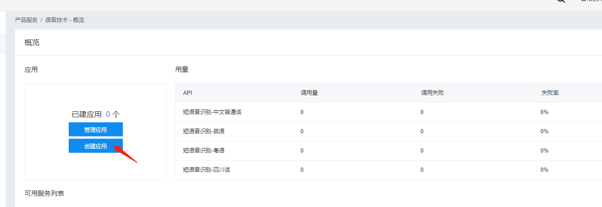

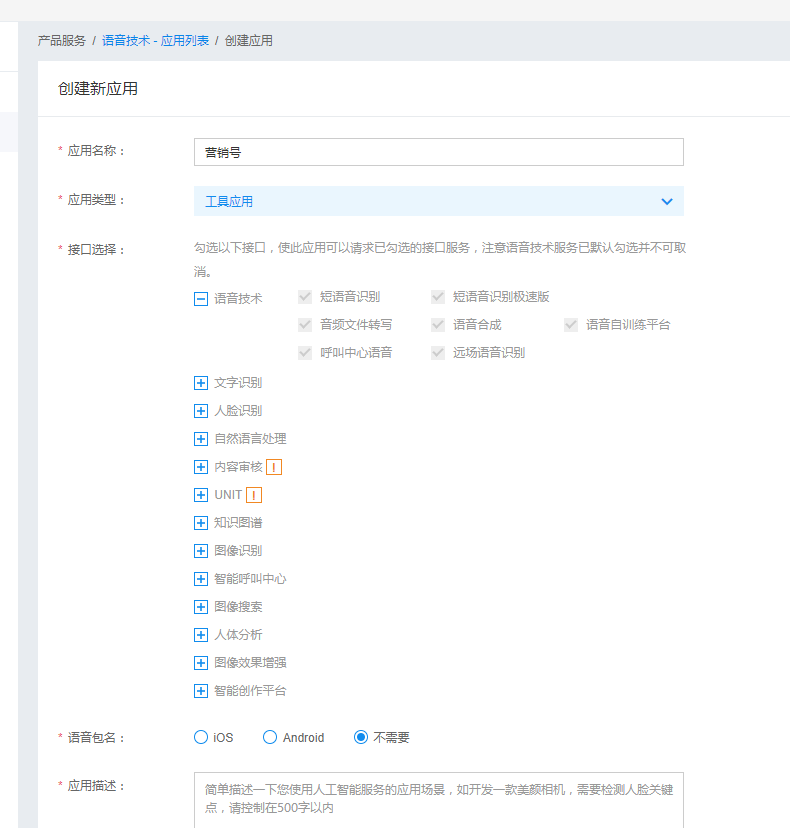

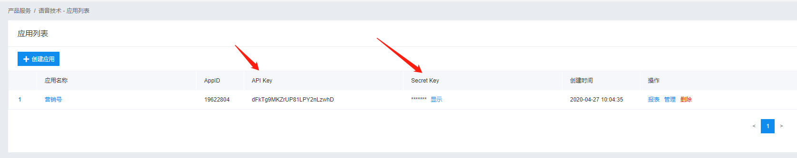

3.进入[腾讯开发者平台](https://console.cloud.tencent.com/cam/capi),点击新建密钥,获取secretid(appid),secretkey备用

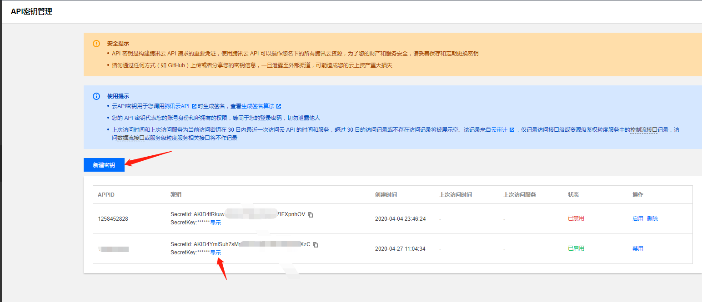

4.开通[腾讯云点播服务](https://console.cloud.tencent.com/vod/media)(!!!注意**腾讯云点播api是收费**的,所以为了钱包考虑,尽量少调用,土豪除外,up主正在努力自建服务器,为大家搭建免费接口)

开通以后去"媒资管理",点击"上传视频",来上传素材,素材视频在"素材"文件夹中,上传以后,可以获得视频的"ID",保存下来备用.

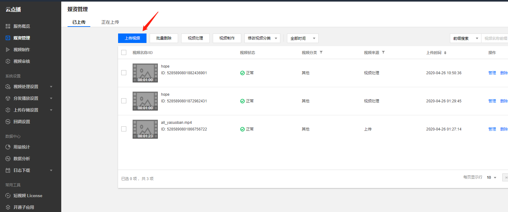

5.fork本源码(或者直接点击下载按钮,下载源码压缩包)

6.使用微信开发者工具导入小程序,目录选择yingxiaoshaoPro-master即可,只要你导入了以后文件结构,跟第七步配图右侧的文件目录一样就行了.[微信开发者工具下载](https://developers.weixin.qq.com/miniprogram/dev/devtools/stable.html)

7.按提示开通云开发

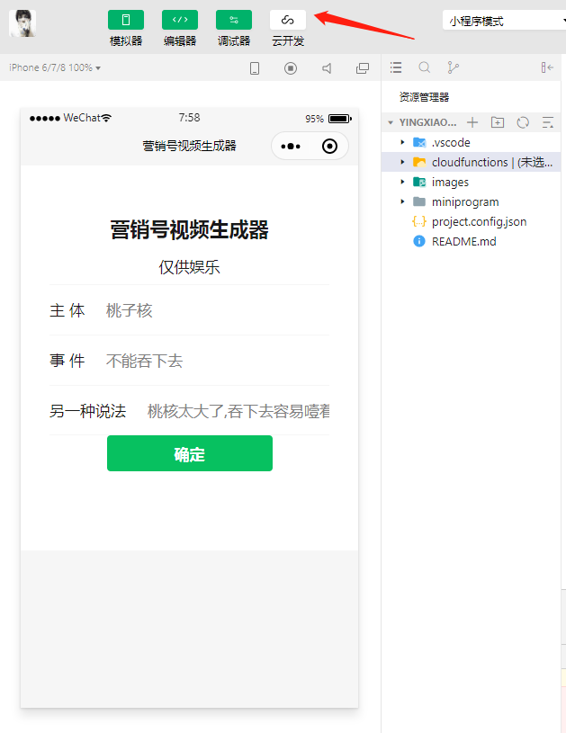

8.修改appid和secret,将video_edit的index.js的第24行换成自己的百度appid

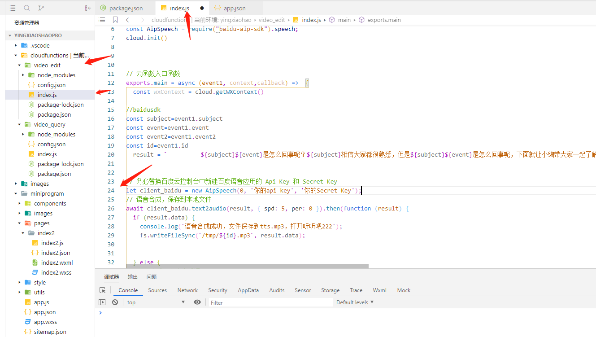

9.同一页面,下拉到第62行,同样修改成自己的腾讯云appid、secret。同时在第71行，将“sourcemedia”后的52***22那一串数字改成自己的素材ID（第四步获得的视频ID）

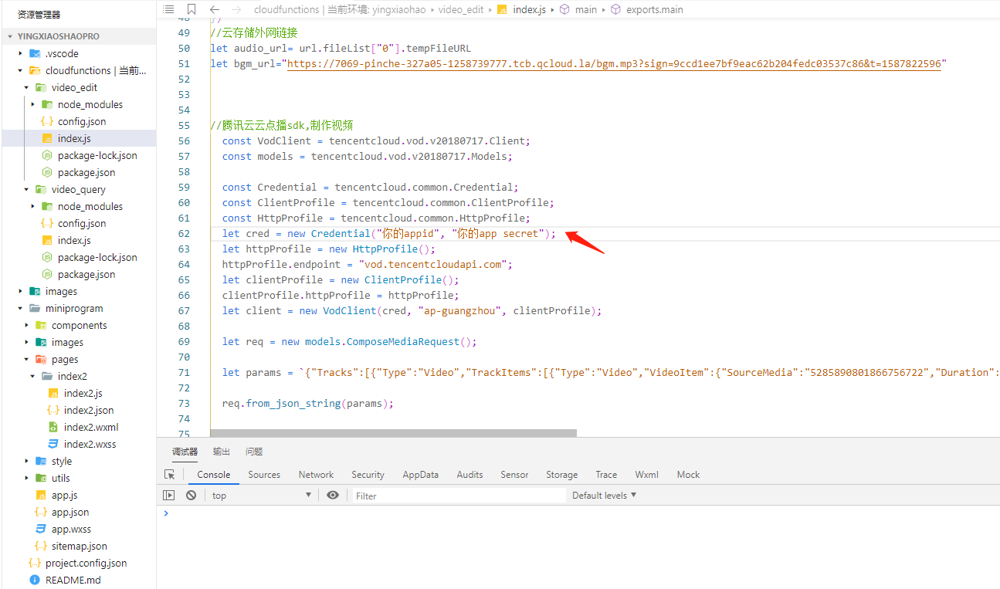

10.video_query的index.js的第21行,同样改成自己的腾讯云appid

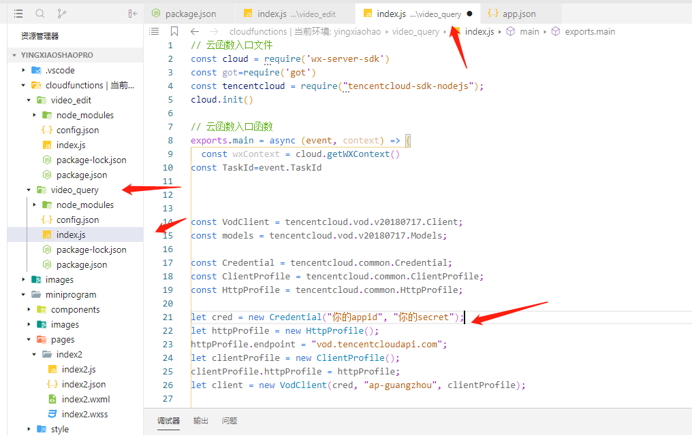

11.先点击"同步云函数列表",会报错,不过没关系.再点击"当前环境",选择你自己创建的云环境名称.如果看不到就把开发者工具重启一下

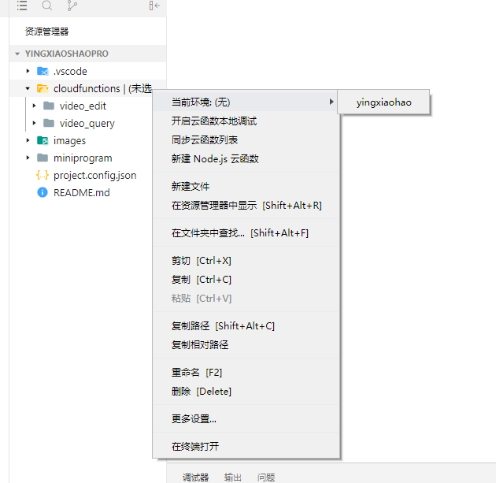

12.依次点击"video_edit"和"video_query"文件夹,点击"创建并部署:云端安装依赖",等待云函数部署成功

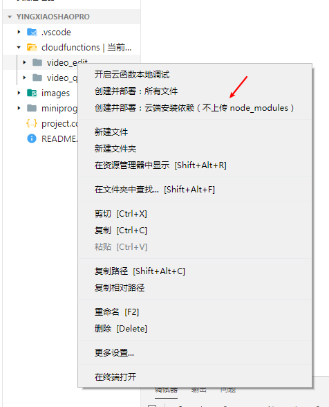

13.部署成功以后,会有提示

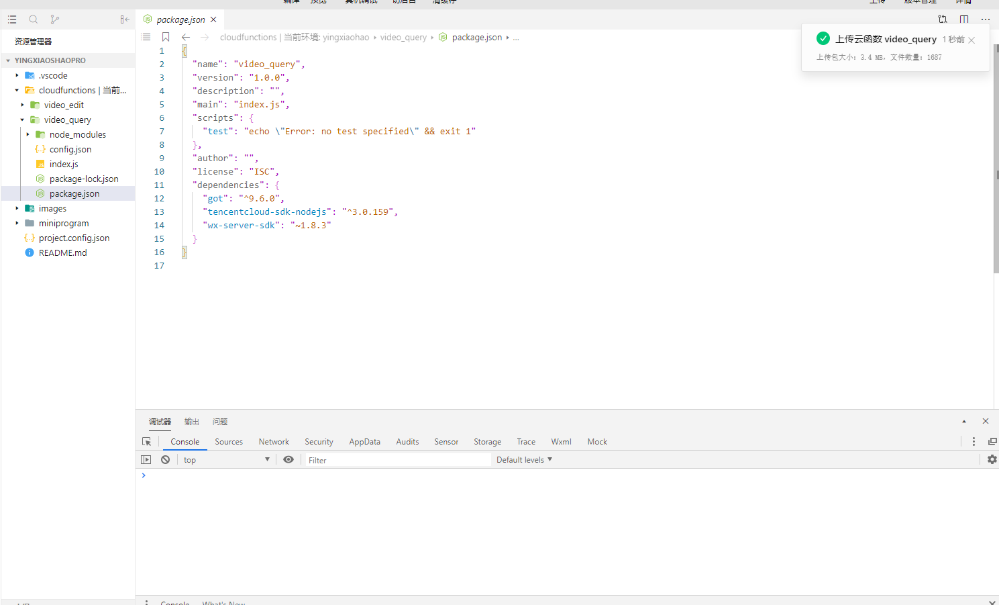

14.在小程序上体验吧

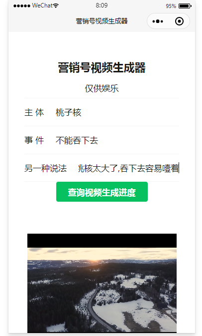